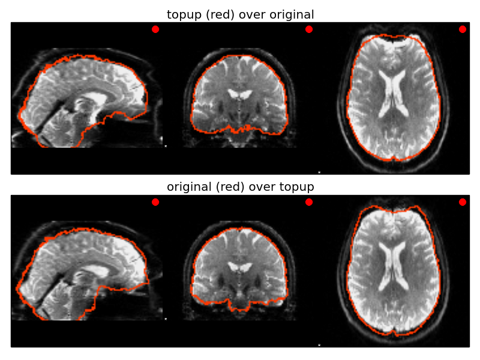

# fsl-topup

## Background  
Diffusion imaging is typically performed using diffusion weighted spin-echo EPI images. These images are very sensitive to off-resonance fields. Such fields are caused by the susceptibility distribution of the subjects head (known as a susceptibility-induced off-resonance field) and by eddy currents (EC) from the rapid switching of the diffusion weighting gradients (known as an eddy current-induced off-resonance field). Topup is a tool for estimating the susceptibility induced field.

https://fsl.fmrib.ox.ac.uk/fsl/fslwiki/topup

[Andersson 2003](https://www.ncbi.nlm.nih.gov/pubmed/14568458) J.L.R. Andersson, S. Skare, J. Ashburner. How to correct susceptibility distortions in spin-echo echo-planar images: application to diffusion tensor imaging. NeuroImage, 20(2):870-888, 2003.

[Smith 2004](https://www.ncbi.nlm.nih.gov/pubmed/15501092) S.M. Smith, M. Jenkinson, M.W. Woolrich, C.F. Beckmann, T.E.J. Behrens, H. Johansen-Berg, P.R. Bannister, M. De Luca, I. Drobnjak, D.E. Flitney, R. Niazy, J. Saunders, J. Vickers, Y. Zhang, N. De Stefano, J.M. Brady, and P.M. Matthews. Advances in functional and structural MR image analysis and implementation as FSL. NeuroImage, 23(S1):208-219, 2004.

[Graham 2017](https://www.ncbi.nlm.nih.gov/pubmed/28968429) M.S. Graham, I. Drobnjak, H. Zhang. Quantitative assessment of the susceptibility artefact and its interaction with motion in diffusion MRI. PLoS ONE, 12(10), 2017.

## Gear usage
This gear currently uses two images that are sampled with different (ideally opposite) phase-encoding directions and calculates the topup field.  This gear optionally performs a topup correction on the two input images, and can also perform topup correction on two additional images.  

The gear allows you to choose a number of optional outputs besides the standard topup field approximation.  
The gear always runs topup with the *--out*, *--fout*, and *--iout* options.  

### Inputs

#### Required
* **image_1**: the first image to use in the topup calculation.  
* **image_2**: the second image to use in the topup calculation.  
* **acquisition_parameters**: the input to the [--datain](https://fsl.fmrib.ox.ac.uk/fsl/fslwiki/topup/TopupUsersGuide#A--datain) option for topup, a text file with PE directions/times.  In this text file, row 1 corresponds to **image_1**, and row 2 corresponds to **image_2**.  

**image_1** and **image_2** can be either 3D or 4D images.  If they are 3D, then topup is estimated, and by default these two are corrected.  If they are 4D, then the first volume from each acquisition is used for the topup calculation.  Then, topup correction is applied to the full 4D image, unless **topup_only** is selected from the config file.  

#### Optional  
* **apply_to_1**: A third image to apply the topup correction calculated from **image_1** and **image_2**.  This image must have the same PE direction as **image_1**  
* **apply_to_2**: A fourth image to apply the topup correction calculated from **image_1** and **image_2**.  This image must have the same PE direction as **image_2**  
* **config_file**: a config file to pass into topup to use with the [--config](https://fsl.fmrib.ox.ac.uk/fsl/fslwiki/topup/TopupUsersGuide#Configuration_files) option.  

### Config settings  
* **gear-log-level**: Gear Log verbosity level (ERROR|WARNING|INFO|DEBUG)  
* **topup_only**: only run topup and get correction fields (do no correct images, either 4D inputs, or additional **apply_to_X** images)  
* **displacement_field** save displacement fields (hidden topup option *--dfout*)  
* **jacobian_determinants** save jacobian determinants (hidden topup option *--jacout*)  
* **rigid_body_matrix** save rigid body transformation matricies to align volumes (hidden topup option *--rbmout*)  
* **verbose** output verbose information to the log (topup option *--verbose*)  
* **topup_debug_level** Topup Log verbosity level (0|1|2|3) (hidden topup option *--debug*).  **WARNING** this produces a LOT of additional files.  
* **QA** Save a topup QA image comparing distorted to corrected images  

### Outputs  

Depending on the settings in the gear's conguration, you will have some of the following files:  

#### *Constant Output*  
* **topup-log.txt**: topup's log file  
* **topup-fmap.nii.gz**: output-file containing the off-resonance field.  
* **topup-fieldcoef.nii.gz**: output-files containing the spline coefficients for the off-resonance field  
* **topup-movpar.txt**: The transformation parameters to fit **image_2** to **image_1**  
* **topup-input-corrected.nii.gz**: The corrected version of the merged **image_1** and **image_2** used for topup's *--imain* input option  

#### *Output with **apply_to_X** options, and **topup_only** is false*  
* **topup-corrected-<apply_to_1>.nii.gz**: Topup corrected image from **apply_to_1**  
* **topup-corrected-<apply_to_2>.nii.gz**: Topup corrected image from **apply_to_2**  
*note that if **image-1** and **image-2** are 4D, this gear will also create TOPUP corrected versions of **image-1** and **image-2**.  The output name will be topup-corrected-<image-1>.  

#### *Output with **QA***  
* **<image_1>-QA-report.png**: QA image from **image_1**  
* **<image_2>-QA-report.png**: QA image from **image_2**  
*Presently only runs on files that have been corrected with topup.  Won't work if **topup_only** is true*  

#### *Output with **displacement_field***  
* **topup-dfield-01.nii.gz**: warp field for **image_1**  
* **topup-dfield-02.nii.gz**: warp field for **image_2**  

#### *Output with **jacobian_determinants***  
* **topup-jacdet-01.nii.gz**: jacobian determinants for **image_1**  
* **topup-jacdet-02.nii.gz**: jacobian determinants for **image_2**  

#### *Output with **rigid_body_matrix***  
* **topup-rbmat-01.mat**: rigid body transformation parameters to fit **image_1** to **image_1** (should be identity)  
* **topup-rbmat-02.mat**: rigid body transformation parameters to fit **image_2** to **image_1**  

### QA

The QA image for this gear will resemble the following:

  

The top image is the original input, with a red overlay of the topup-corrected brain boarder outline.  
The bottom image is the topup corrected image, with a red overlay of the original image brain boarder outline.  
Ideally, you should see improvement in the shape of the brain's outline, correcting for major distortions such as the one in the front of the brain in the far right  
© Copyright 2019, Josh Revision
